   <div align="center">
        <h1>🏛️ LibriPal - AI Library Assistant</h1>
    </div>


<div align="center">


**An intelligent chatbot-powered library management system designed for modern students**

[](https://python.org)
[](https://fastapi.tiangolo.com)
[](https://reactjs.org)
[](https://postgresql.org)


</div>

---

## 🌟 Overview

LibriPal revolutionizes the traditional library experience by providing an intelligent, conversational interface for all your library needs. Say goodbye to complex library systems and hello to intuitive, chat-based interactions!

Problem statement: AI powered Library and book reminder

### 🎯 Why LibriPal?

- **🤖 Smart Conversations** - Natural language processing for intuitive queries
- **⚡ Instant Responses** - Get information faster than traditional search
- **📱 Modern Interface** - Clean, responsive design for all devices
- **🔔 Proactive Alerts** - Never miss a due date again

---

## ✨ Features

<table>
<tr>
<td width="50%">

### 🤖 **Intelligent Chatbot**
- Natural language book search
- Query auto-prediction and suggestions
- Conversational book recommendations
- Library policy assistance

</td>
<td width="50%">

### 📚 **Book Management**
- Easy book issuing and renewals
- Real-time availability checking
- Digital book tracking
- Reading history management

</td>
</tr>
<tr>
<td width="50%">

### 🔔 **Smart Notifications**
- Automated return reminders
- Overdue alerts via multiple channels
- Renewal notifications
- Fee payment reminders

</td>
<td width="50%">

### 💰 **Fee Management**
- Real-time outstanding fee tracking
- Payment history and receipts
- Transparent fee calculations
- Multiple payment options

</td>
</tr>
</table>

---

## 🚀 Quick Start

### 📋 Prerequisites

Before you begin, ensure you have the following installed:

- **Python 3.10+** - [Download here](https://python.org/downloads)
- **Node.js 18+** - [Download here](https://nodejs.org)
- **uv** - Fast Python package manager
- **PostgreSQL** - For production (SQLite for development)

### ⚙️ Backend Setup

```bash
# 📦 Clone the repository
git clone https://github.com/Nav0711/LibriPal.git
cd LibriPal

# 🔧 Install dependencies with uv
uv sync

# 🚀 Activate virtual environment
# Windows
.venv\Scripts\Activate
# macOS/Linux
# source .venv/bin/activate

# 🔑 Configure environment variables
# Create .env file and add your Gemini API key
echo "GEMINI_API_KEY=your_gemini_key_here" > .env

# 🏃‍♂️ Start the backend server
python main.py
```

> **✅ Success!** Backend running at: http://localhost:8000/docs

### 🎨 Frontend Setup

```bash
# 📁 Navigate to frontend directory
cd frontend

# 📦 Install dependencies
npm install

# 🚀 Start development server
npm run start
```

> **✅ Success!** Frontend running at: http://localhost:3000

---

## 💻 Tech Stack

<div align="center">

### Frontend Technologies


### Backend Technologies


</div>

---

## 📱 Screenshots

<div align="center">


### 💬 Chat Interface


### Book Search Feature


</div>

---

## 🔄 Usage Flow

```mermaid
graph TD
    A[🚀 Start Backend Server] --> B[🎨 Launch Frontend]
    B --> C[💬 Open Chat Interface]
    C --> D{What would you like to do?}
    D -->|Search Books| E[🔍 Book Search & Issue]
    D -->|Renew Books| F[🔄 Book Renewal]
    D -->|Check Fees| G[💰 Fee Management]
    D -->|Get Reminders| H[🔔 Notification Setup]
    E --> I[✅ Task Completed]
    F --> I
    G --> I
    H --> I
```



### 📝 Step-by-Step Guide

1. **🌐 Access the Application**
   - Backend API: http://localhost:8000/docs
   - Frontend Interface: http://localhost:3000

2. **💬 Start Chatting**
   - Type natural language queries
   - Get instant, intelligent responses
   - Follow suggested actions

3. **📚 Library Operations**
   - Search and issue books conversationally
   - Renew books before due dates
   - Track reading progress

4. **🔔 Stay Updated**
   - Receive smart notifications
   - Get reminders via chat, email, or Telegram
   - Monitor outstanding fees

---

## 🤝 Contributing

We welcome contributions! Please see our [Contributing Guidelines](CONTRIBUTING.md) for details.

### 🐛 Found a Bug?
Open an issue on our [GitHub Issues](https://github.com/Nav0711/LibriPal/issues) page.

### 💡 Have a Feature Request?
We'd love to hear your ideas! Create a feature request issue.

---

